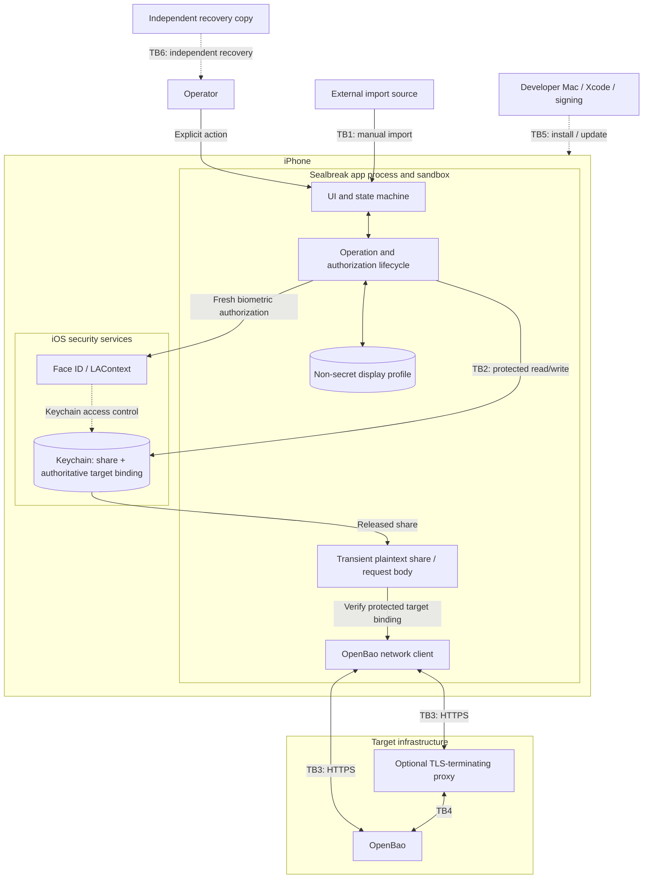
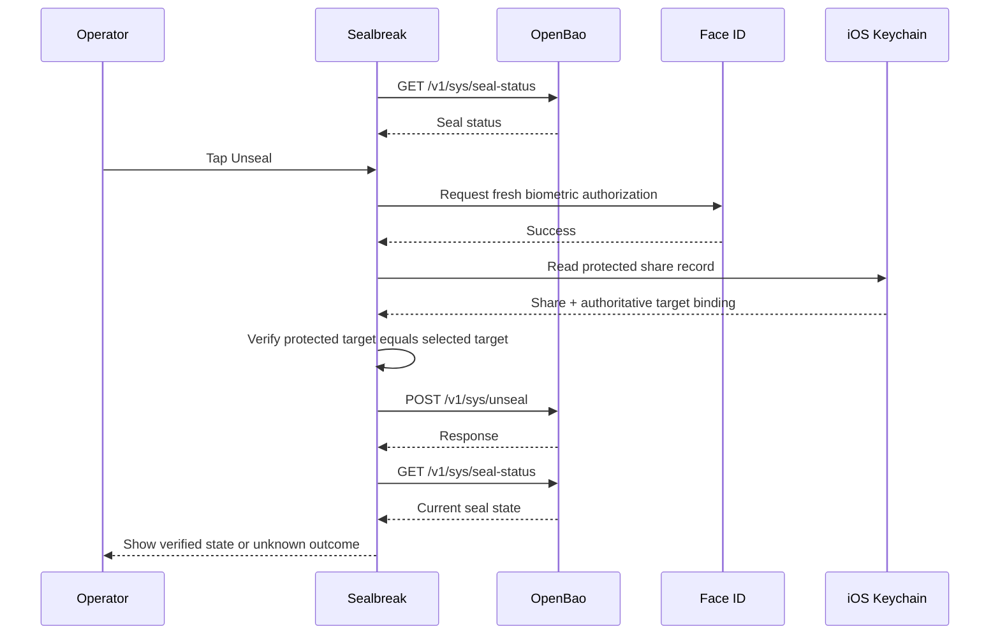

# Sealbreak Threat Model

## 1. Scope, Assets, and Assumptions

### 1.1 Scope

Sealbreak is an iOS application that stores one OpenBao Shamir unseal share on an iPhone, protects access to that share with Face ID and iOS Keychain controls, and submits the share to one explicitly configured OpenBao endpoint after a current operator action.

In scope:

- local storage of one Shamir share;
- Face ID authorization and Keychain access control;
- server profile storage and share-to-target binding;
- seal-status checks and manual unseal submission;
- local share replacement and deletion;
- application network behavior;
- the application build, signing, and update path insofar as it affects share confidentiality and integrity.

Out of scope:

- OpenBao, HashiCorp Vault, or another compatible server's internal implementation security;
- general server administration, policy management, and secret browsing;
- auto-unseal and seal migration;
- cloud synchronization of the share;
- protection against an already fully compromised iPhone or developer workstation;
- the security of external recovery copies beyond Sealbreak's requirement that recovery exists independently of the app.

### 1.2 Assets

| ID | Asset | Security objective |
| --- | --- | --- |
| **A01** | Shamir share | Prevent disclosure except during an explicitly authorized unseal operation |
| **A02** | Share-to-server binding | Prevent a stored share from being redirected to another target |
| **A03** | Operator intent | Require a current, explicit operator action before share release |
| **A04** | Recovery capability | Device loss or Keychain invalidation must not cause permanent lock-out |
| **A05** | OpenBao target identity | Prevent submission to an unintended or spoofed endpoint |
| **A06** | Application integrity | Prevent a malicious build or update from stealing an authorized share |

A compromised share is especially significant when OpenBao is configured with a threshold of one. In a 1-of-1 configuration, one stolen share represents the full unseal quorum.

### 1.3 Assumptions

| ID | Assumption |
| --- | --- |
| **AN01** | The conservative baseline is a 1-of-1 Shamir configuration |
| **AN02** | The iPhone has a device passcode and Face ID enabled |
| **AN03** | The iPhone is not already fully compromised |
| **AN04** | OpenBao is manually unsealed with Shamir shares |
| **AN05** | Network communication uses HTTPS |
| **AN06** | An independent recovery copy exists outside the iPhone and Sealbreak |
| **AN07** | The configured OpenBao instance and any TLS-terminating proxy are intended trusted infrastructure |
| **AN08** | The operator explicitly initiates every unseal attempt |

## 2. Architecture and Trust Boundaries

### 2.1 Data Flow Diagram



### 2.2 Trust Boundaries

| Boundary | Transition | Security relevance |
| --- | --- | --- |
| **TB1** | External import source → Sealbreak | Existing clipboard, password-manager, note, chat, or terminal copies are outside Sealbreak control |
| **TB2** | App → Keychain / Face ID | iOS must enforce access to the share itself, not merely access to the visible UI |
| **TB3** | iPhone → OpenBao or TLS proxy | Server identity and transport must be authenticated; redirects must not retarget the share |
| **TB4** | TLS proxy → OpenBao | A proxy expands the trusted infrastructure and can observe the share after TLS termination |
| **TB5** | Build/signing path → installed app | A malicious but validly signed build can misuse a legitimately released share |
| **TB6** | Sealbreak/device → independent recovery | Recovery must remain usable without the original iPhone, app, or sealed server instance |

### 2.3 Security-Critical Unseal Flow



A successful HTTP response alone is not treated as proof that OpenBao is fully unsealed. Sealbreak re-checks the seal state after submission. If submission may already have reached the server but verification fails, the final outcome is treated as unknown and the app does not retry automatically.

## 3. Threat Analysis — STRIDE

STRIDE covers Spoofing, Tampering, Repudiation, Information Disclosure, Denial of Service, and Elevation of Privilege.

### 3.1 Spoofing

#### T01 — Spoofed OpenBao server

An attacker attempts to make Sealbreak submit a valid share to an unintended endpoint.

Current controls include HTTPS-only canonical origins, normal certificate and hostname validation, rejection of redirects, and validation that the response URL matches the request URL. These controls do not protect against a compromised legitimate endpoint or a wrongly enrolled but otherwise valid endpoint.

Affected assets: **A01, A05**

Controls: **M03, M04**

#### T02 — Manipulated target binding

An attacker or corrupted local metadata attempts to associate a stored share with another server.

The authoritative server profile is stored together with the share in the protected Keychain record. Before submission, Sealbreak compares that protected profile with the selected profile and aborts on mismatch. The separate display profile is therefore not sufficient to retarget a share.

Affected assets: **A01, A02, A05**

Controls: **M04**

#### T03 — Biometric access-control bypass

An attacker attempts to retrieve or use the stored share without a current biometric authorization.

The Keychain item uses `kSecAttrAccessibleWhenPasscodeSetThisDeviceOnly` with `biometryCurrentSet`. Sealbreak creates a fresh `LAContext` for every sensitive operation, requires Face ID, disables application fallback, and invalidates the context when the operation ends. Actual device behavior after Face ID changes, lockout, cancellation, and migration remains dependent on iOS enforcement and should be validated on physical hardware.

Affected assets: **A01, A03**

Controls: **M01, M02**

### 3.2 Tampering

#### T04 — Manipulated or incorrect seal status

Malformed, stale, or attacker-controlled status data could cause the application to present an incorrect state or proceed under false assumptions.

Sealbreak accepts only HTTP 200 JSON responses from the expected URL, bounds response size, decodes into a typed model, and validates basic state consistency. It re-checks status after submission. These controls cannot make a compromised legitimate OpenBao server truthful.

Affected assets: **A03, A05**

Controls: **M05**

#### T05 — Broken share lifecycle

A failed replacement or deletion path could corrupt or destroy the local share.

Replacement updates the existing Keychain item rather than deleting it first. All readers and writers use a common encoded-record size limit, and an oversized replacement is rejected before the Keychain update. Replacement still cannot prove that the new share is cryptographically valid for the server; independent recovery remains required.

Affected assets: **A01, A04**

Controls: **M08, M09**

#### T06 — Reuse of a stolen share

A Shamir share is not a one-time credential. An attacker who obtains a copy can submit it again after OpenBao is resealed without using Sealbreak or Face ID.

Sealbreak limits its own behavior to one controlled submission per explicit action and performs no automatic retry, but it cannot make a copied Shamir share expire or bind it cryptographically to the app, device, operator, or time of use.

Affected assets: **A01, A03**

Controls: **M02, M05, M06, M09**

### 3.3 Repudiation

#### T07 — Weak actor attribution

OpenBao receives the submitted share but does not receive cryptographic proof that a particular person completed Face ID on a particular iPhone.

Sealbreak therefore does not claim individual server-verifiable attribution. A successful unseal also does not prove which operator completed the quorum.

Affected assets: **A03**

Controls: **M12**

### 3.4 Information Disclosure

#### T08 — Share remains in the import or recovery source

A share may already exist in a password manager, clipboard history, note, screenshot, chat application, terminal, backup, or other external source before Sealbreak imports it.

Sealbreak performs no automatic clipboard read and provides no share-export feature, but it cannot revoke or control copies that already exist elsewhere.

Affected assets: **A01**

Controls: **M07, M09**

#### T09 — Share appears in diagnostics

Sensitive data could leak through logs, analytics, crash reports, request dumps, caches, server error reflection, or temporary files.

Sealbreak contains no application analytics or share logging, uses an ephemeral URL session, disables caches, cookies, and credential storage, does not display response bodies on error, and deliberately keeps diagnostic messages coarse. Infrastructure such as TLS proxies and external crash tooling remains outside the app's direct control.

Affected assets: **A01**

Controls: **M06, M12**

#### T10 — Share read from process memory

After successful Face ID authorization, the share must briefly exist in Sealbreak process memory so it can be serialized and transmitted.

Sealbreak performs best-effort cleanup of mutable buffers and uses short-lived request data, but Swift strings, serialization internals, networking, a debugger, or a sufficiently privileged process attacker may retain or inspect copies. Guaranteed memory erasure is not claimed.

Affected assets: **A01, A06**

Controls: **M01, M02, M06, M11**

#### T11 — Unexpected synchronization, backup, or migration

Incorrect storage configuration could copy the protected share to another device or backup channel.

The Keychain query explicitly disables synchronization and uses `WhenPasscodeSetThisDeviceOnly`. The non-secret display profile is stored with complete file protection and excluded from backup. Real backup, restore, and device-migration behavior still depends on platform enforcement and should be tested on physical devices.

Affected assets: **A01, A02**

Controls: **M01, M06, M08**

### 3.5 Denial of Service

#### T12 — Device, Face ID, or application-identity loss

Device loss, hardware failure, Face ID re-enrollment, Keychain invalidation, app deletion, or an application-identity change may make the local share inaccessible.

This is partly an intentional consequence of device-bound storage. Sealbreak requires an independent recovery copy before import and replacement, but that requirement does not prove the external recovery procedure has been tested successfully.

Affected assets: **A04**

Controls: **M08, M09**

#### T13 — Bootstrap dependency failure

Unseal may depend on DNS, a VPN, certificates, or a TLS proxy that is itself unavailable while OpenBao is sealed.

Sealbreak has bounded request timeouts and fails closed, but it cannot repair an unavailable dependency. The deployment must ensure that the network path required for unseal does not depend on secrets that are themselves unavailable while OpenBao is sealed.

Affected assets: **A04, A05**

Controls: **M05, M10**

#### T14 — Wrong cluster node

In a clustered deployment, Shamir unseal progress is node-specific. Requests routed to different nodes can prevent quorum completion or produce misleading progress.

Sealbreak is configured with one explicit origin but does not cryptographically bind requests to a node identity or an unseal attempt. Deployment routing must therefore keep the status and share submissions directed to the intended node.

Affected assets: **A04, A05**

Controls: **M05, M10**

### 3.6 Elevation of Privilege

#### T15 — Malicious application or update

A compromised developer workstation, signing account, build process, or distributed application could produce a legitimate-looking Sealbreak build that requests valid Face ID authorization and then copies the released share.

The project has a small dependency surface, but local biometric controls cannot defend against code that is itself authorized to access the Keychain item after successful authentication.

Affected assets: **A01, A06**

Controls: **M11**

#### T16 — Compromised legitimate OpenBao infrastructure

Sealbreak may connect to the intended hostname with valid TLS while the OpenBao host or TLS-terminating proxy is already compromised. A valid unseal operation would then disclose the share to compromised infrastructure.

This is an architectural trust dependency. Correct TLS validation confirms endpoint identity, not endpoint integrity.

Affected assets: **A01, A05**

Controls: **M10**

#### T17 — Single share represents the full quorum

With a 1-of-1 Shamir configuration, disclosure of the one stored share is equivalent to disclosure of the complete unseal quorum.

A higher threshold can reduce the impact only when additional shares are held independently. Storing all required shares on the same device would not provide meaningful custody separation.

Affected assets: **A01, A04**

Controls: **M09, M10**

## 4. Risk Assessment and Controls

### 4.1 Scoring

```text
Risk = Likelihood × Impact
```

#### Likelihood

| Score | Meaning |
| --- | --- |
| **1** | Requires exceptional conditions |
| **2** | Requires a targeted attack or several prerequisites |
| **3** | Plausible under realistic conditions |
| **4** | Relatively easy and repeatable |
| **5** | Successful scenario is highly likely |

#### Impact

| Score | Meaning |
| --- | --- |
| **1** | Minor local effect |
| **2** | Limited security or operational effect |
| **3** | Significant local compromise or operational outage |
| **4** | Severe compromise or extended outage |
| **5** | Full quorum compromise, major secret exposure, or irreversible lock-out |

### 4.2 Risk Matrix

| Likelihood ↓ / Impact → | **1** | **2** | **3** | **4** | **5** |
| --- | ---: | ---: | ---: | ---: | ---: |
| **5** | 5 Medium | 10 High | 15 High | 20 Critical | 25 Critical |
| **4** | 4 Low | 8 Medium | 12 High | 16 High | 20 Critical |
| **3** | 3 Low | 6 Medium | 9 Medium | 12 High | 15 High |
| **2** | 2 Low | 4 Low | 6 Medium | 8 Medium | 10 High |
| **1** | 1 Low | 2 Low | 3 Low | 4 Low | 5 Medium |

### 4.3 Risk Register

The current assessment reflects application, project, and deployment controls relevant to each threat. Residual risk is the risk that remains after these controls are considered.

A residual risk rating does not imply risk acceptance. This threat model does not accept risks on behalf of users or operators. Risks may require further mitigation, deployment controls, avoidance, transfer, or an explicit acceptance decision.

| Threat | Likelihood | Impact | Residual risk | Controls | Basis |
| --- | ---: | ---: | ---: | --- | --- |
| **T01** Spoofed OpenBao server | 1 | 5 | **5 Medium** | M03, M04 | HTTPS validation, canonical origins, blocked redirects, expected response URL |
| **T02** Manipulated target binding | 1 | 5 | **5 Medium** | M04 | Authoritative profile stored with share and compared before submission |
| **T03** Biometric access-control bypass | 1 | 5 | **5 Medium** | M01, M02 | Device-bound Keychain protection and fresh Face ID context; physical-device validation still relevant |
| **T04** Incorrect seal status | 2 | 3 | **6 Medium** | M05 | Typed, bounded, validated status with post-submit re-check; compromised server can still lie |
| **T05** Broken share lifecycle | 2 | 3 | **6 Medium** | M08, M09 | In-place replacement and common encoded-size invariant; independent recovery still required |
| **T06** Reuse of stolen share | 2 | 5 | **10 High** | M02, M05, M06, M09 | Copied Shamir share remains reusable outside Sealbreak |
| **T07** Weak actor attribution | 3 | 2 | **6 Medium** | M12 | OpenBao receives no cryptographic proof of local Face ID or specific human identity |
| **T08** External import/recovery copy stolen | 2 | 5 | **10 High** | M07, M09 | Sealbreak cannot control copies that exist outside the app |
| **T09** Diagnostic leak | 1 | 5 | **5 Medium** | M06, M12 | No application logging or analytics; caches and response-body reflection disabled |
| **T10** Runtime memory compromise | 2 | 5 | **10 High** | M01, M02, M06, M11 | Authorized share must exist transiently in process and networking memory |
| **T11** Unexpected synchronization or migration | 1 | 5 | **5 Medium** | M01, M06, M08 | `ThisDeviceOnly` plus synchronization disabled; platform behavior remains trusted |
| **T12** Device, biometric, or identity loss | 2 | 5 | **10 High** | M08, M09 | Device binding can intentionally make the local item inaccessible; recovery is external |
| **T13** Bootstrap dependency failure | 2 | 2 | **4 Low** | M05, M10 | App fails closed but depends on reachable DNS, VPN, certificates, and optional proxy |
| **T14** Wrong cluster node | 2 | 3 | **6 Medium** | M05, M10 | Node affinity is a deployment requirement, not an app-enforced invariant |
| **T15** Malicious application or update | 2 | 5 | **10 High** | M11 | Authorized code can misuse an authorized Keychain release |
| **T16** Compromised legitimate infrastructure | 2 | 5 | **10 High** | M10 | Correct TLS does not protect against a compromised intended target or proxy |
| **T17** 1-of-1 quorum compromise | 2 | 5 | **10 High** | M09, M10 | One stolen share is the full quorum in the conservative baseline |

### 4.4 Controls

| Control | Scope | Requirement / implementation intent |
| --- | --- | --- |
| **M01 — Keychain protection** | Application | Store the share with `kSecAttrAccessibleWhenPasscodeSetThisDeviceOnly`, `biometryCurrentSet`, and synchronization disabled |
| **M02 — Fresh authorization** | Application | Require a new Face ID authorization context for every sensitive share operation and invalidate it afterwards |
| **M03 — Transport** | Application | HTTPS only, normal certificate and hostname validation, TLS 1.2 or newer, and blocked redirects |
| **M04 — Target binding** | Application | Store the authoritative server profile with the share and compare it before submission |
| **M05 — State machine and request discipline** | Application | Validate seal state, permit only supported Shamir states, perform one explicit submission per action, never automatically retry, and verify state afterwards |
| **M06 — Data minimization** | Application | Do not log, analyze, cache, export, or persist the share outside the protected record; minimize diagnostic detail and clear mutable buffers where practical |
| **M07 — Secure import** | Application | Do not read the clipboard automatically and do not provide share export functionality |
| **M08 — Safe share lifecycle** | Application | Require fresh authorization for replace/delete operations, use safe in-place updates, and enforce one encoded storage-size invariant across readers and writers |
| **M09 — Recovery and incident response** | Operator / deployment | Maintain independent recovery and use OpenBao rekeying to replace compromised server-side shares |
| **M10 — Secure infrastructure** | Operator / deployment | Protect OpenBao, TLS proxies, VPN, DNS, certificates, node routing, and bootstrap dependencies outside the application |
| **M11 — Software supply chain** | Project / release | Protect signing rights and developer systems, keep dependencies minimal, and review distributed builds and updates |
| **M12 — Minimal diagnostics and attribution claims** | Application / project | Never record secret material and do not claim server-verifiable proof of which human completed an unseal quorum |
