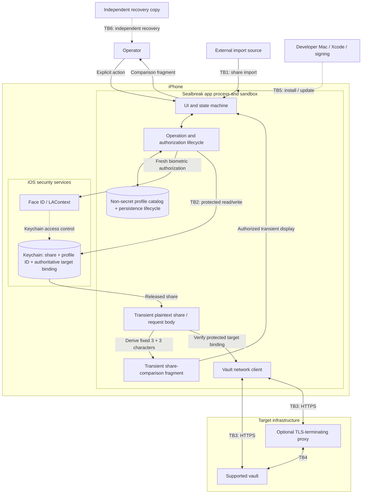
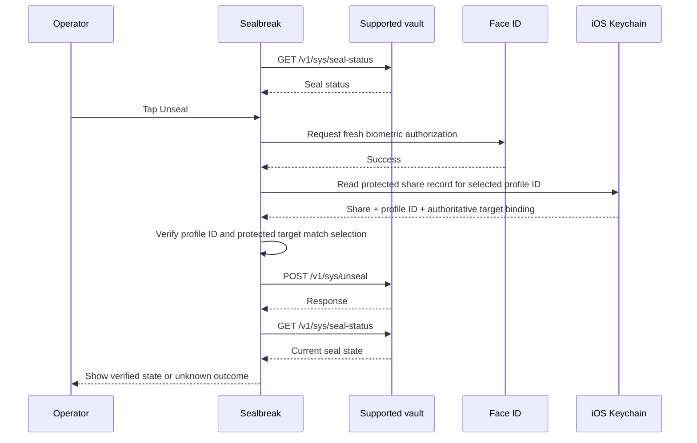
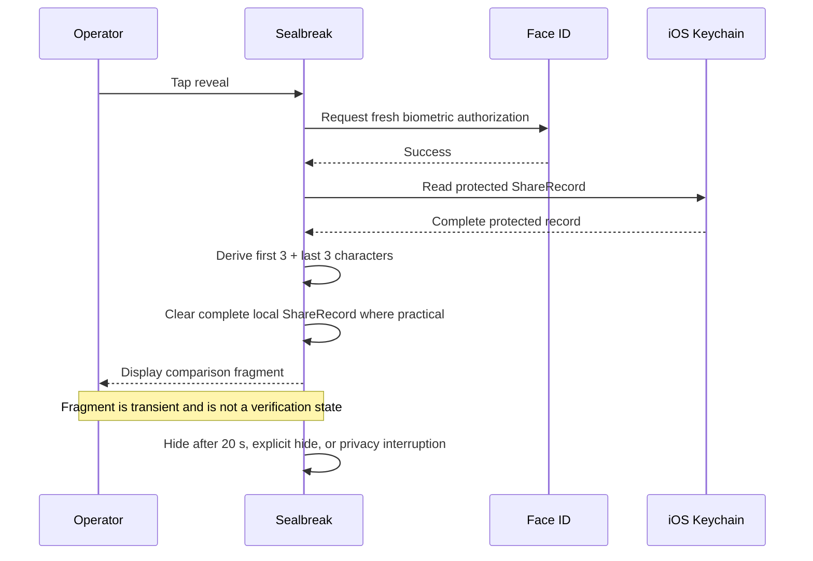

# Sealbreak Threat Model

## 1. Scope, Assets, and Assumptions

### 1.1 Scope

Sealbreak is an iOS application that stores one Shamir unseal share for a supported vault on an iPhone, protects access to that share with Face ID and iOS Keychain controls, and submits the share to one explicitly configured vault endpoint after a current operator action.

Throughout this document, **vault** means a Sealbreak-supported server that is manually unsealed with Shamir shares, currently OpenBao and HashiCorp Vault.

In scope:

- local storage of one Shamir share;
- biometric-authorized display of a minimized share-comparison fragment;
- Face ID authorization and Keychain access control;
- server profile storage and share-to-target binding;
- seal-status checks and manual unseal submission;
- local share replacement and deletion;
- application network behavior;
- the application build, signing, and update path insofar as it affects share confidentiality and integrity.

Out of scope:

- the internal implementation security of supported vault servers;
- general server administration, policy management, and secret browsing;
- auto-unseal and seal migration;
- cloud synchronization of the share;
- protection against an already fully compromised iPhone or developer workstation;
- the security of external recovery copies beyond Sealbreak's requirement that recovery exists independently of the app.

### 1.2 Assets

| ID | Asset | Security objective |
| --- | --- | --- |
| **A01** | Shamir share | Prevent disclosure of the complete share except during explicitly authorized sensitive operations; preserve controlled availability for authorized use; minimize and strictly limit any intentional partial disclosure |
| **A02** | Share-to-server binding | Prevent a stored share from being redirected to another target |
| **A03** | Operator intent | Require a current, explicit operator action before share release or disclosure of share-derived data |
| **A05** | Vault target identity | Prevent submission to an unintended or spoofed endpoint |
| **A06** | Application integrity | Prevent a malicious build or update from stealing an authorized share |

A compromised share is especially significant when the configured vault uses a threshold of one. In a 1-of-1 configuration, one stolen share represents the full unseal quorum.

### 1.3 Assumptions

| ID | Assumption |
| --- | --- |
| **AN01** | The conservative baseline is a 1-of-1 Shamir configuration |
| **AN02** | The iPhone has a device passcode and Face ID enabled |
| **AN03** | The iPhone is not already fully compromised |
| **AN04** | The configured vault is manually unsealed with Shamir shares |
| **AN05** | Network communication uses HTTPS |
| **AN06** | An independent recovery copy exists outside the iPhone and Sealbreak |
| **AN07** | The configured vault and any TLS-terminating proxy are intended trusted infrastructure |
| **AN08** | The operator explicitly initiates every unseal attempt |

## 2. Architecture and Trust Boundaries

### 2.1 Data Flow Diagram


```mermaid
flowchart TB
    OP["Operator"]
    IMPORT["External import source"]
    REC["Independent recovery copy"]
    BUILD["Developer Mac / Xcode / signing"]

    subgraph PHONE["iPhone"]
        subgraph APP["Sealbreak app process and sandbox"]
            UI["UI and state machine"]
            MODEL["Operation and authorization lifecycle"]
            DISPLAY[("Non-secret profile catalog + persistence lifecycle")]
            MEM["Transient plaintext share / request body"]
            FRAGMENT["Transient share-comparison fragment"]
            NET["Vault network client"]
        end

        subgraph IOS["iOS security services"]
            AUTH["Face ID / LAContext"]
            KC[("Keychain: share + profile ID + authoritative target binding")]
        end
    end

    subgraph TARGET["Target infrastructure"]
        PROXY["Optional TLS-terminating proxy"]
        VAULT["Supported vault"]
    end

    OP -->|"Explicit action"| UI
    IMPORT -->|"TB1: share import"| UI
    BUILD -.->|"TB5: install / update"| APP

    UI <--> MODEL
    MODEL <--> DISPLAY
    MODEL -->|"Fresh biometric authorization"| AUTH
    AUTH -.->|"Keychain access control"| KC
    MODEL -->|"TB2: protected read/write"| KC
    KC -->|"Released share"| MEM
    MEM -->|"Derive fixed 3 + 3 characters"| FRAGMENT
    FRAGMENT -->|"Authorized transient display"| UI
    UI -->|"Comparison fragment"| OP
    MEM -->|"Verify protected target binding"| NET

    NET <-->|"TB3: HTTPS"| VAULT
    NET <-->|"TB3: HTTPS"| PROXY
    PROXY <-->|"TB4"| VAULT

    REC -.->|"TB6: independent recovery"| OP
```

### 2.2 Trust Boundaries

| Boundary | Transition | Security relevance |
| --- | --- | --- |
| **TB1** | External import source → Sealbreak | The external source and any copies it retains are outside Sealbreak control |
| **TB2** | App → Keychain / Face ID | iOS must enforce access to the share itself, not merely access to the visible UI |
| **TB3** | iPhone → configured vault or TLS proxy | Server identity and transport must be authenticated; redirects must not retarget the share |
| **TB4** | TLS proxy → configured vault | A proxy expands the trusted infrastructure and can observe the share after TLS termination |
| **TB5** | Build/signing path → installed app | A malicious but validly signed build can misuse a legitimately released share |
| **TB6** | Sealbreak/device → independent recovery | Recovery must remain usable without the original iPhone, app, or sealed server instance |

### 2.3 Security-Critical Unseal Flow


```mermaid
sequenceDiagram
    participant U as Operator
    participant A as Sealbreak
    participant V as Supported vault
    participant F as Face ID
    participant K as iOS Keychain

    A->>V: GET /v1/sys/seal-status
    V-->>A: Seal status

    U->>A: Tap Unseal
    A->>F: Request fresh biometric authorization
    F-->>A: Success

    A->>K: Read protected share record for selected profile ID
    K-->>A: Share + profile ID + authoritative target binding
    A->>A: Verify profile ID and protected target match selection
    A->>V: POST /v1/sys/unseal
    V-->>A: Response

    A->>V: GET /v1/sys/seal-status
    V-->>A: Current seal state
    A-->>U: Show verified state or unknown outcome
```

A successful HTTP response alone is not treated as proof that the configured vault is fully unsealed. Sealbreak re-checks the seal state after submission. If submission may already have reached the server but verification fails, the final outcome is treated as unknown and the app does not retry automatically.

### 2.4 Security-Critical Share Comparison Flow


```mermaid
sequenceDiagram
    participant U as Operator
    participant A as Sealbreak
    participant F as Face ID
    participant K as iOS Keychain

    U->>A: Tap reveal
    A->>F: Request fresh biometric authorization
    F-->>A: Success
    A->>K: Read protected ShareRecord
    K-->>A: Complete protected record
    A->>A: Derive first 3 + last 3 characters
    A->>A: Clear complete local ShareRecord where practical
    A-->>U: Display comparison fragment
    Note over A,U: Fragment is transient and is not a verification state
    A->>A: Hide after 20 s, explicit hide, or privacy interruption
```

The Keychain releases the complete protected record after authorization; the fragment is derived inside the app process. The Keychain does not expose only the displayed characters. A matching fragment is therefore a limited manual comparison aid and is not proof that the complete stored share matches an independent copy.

## 3. Threat Analysis — STRIDE

STRIDE covers Spoofing, Tampering, Repudiation, Information Disclosure, Denial of Service, and Elevation of Privilege.

### 3.1 Spoofing

#### T01 — Spoofed vault server

An attacker attempts to make Sealbreak submit a valid share to an unintended endpoint.

Current controls include HTTPS-only canonical origins, normal certificate and hostname validation, rejection of redirects, and validation that the response URL matches the request URL. These controls do not protect against a compromised legitimate endpoint or a wrongly enrolled but otherwise valid endpoint.

Affected assets: **A01, A05**

Controls: **M03, M04**

#### T02 — Manipulated target binding

An attacker or corrupted local metadata attempts to associate a stored share with another server.

Each display profile has a stable UUID. The protected Keychain record stores that profile ID and the canonical bound server origin together with the share, but not the display profile itself. The Keychain account is also derived from the profile ID. Before submission, Sealbreak requires both the protected profile ID and protected origin to match the selected profile and aborts on mismatch. Network submission is then built from the protected bound origin, so changing separate display metadata cannot retarget or cross-associate a share.

Affected assets: **A01, A02, A05**

Controls: **M04**

#### T03 — Biometric access-control bypass

An attacker attempts to retrieve or use the stored share without a current biometric authorization.

The Keychain item uses `kSecAttrAccessibleWhenPasscodeSetThisDeviceOnly` with `biometryCurrentSet`. Sealbreak creates a fresh `LAContext` for every sensitive operation, requires Face ID, disables application fallback, and invalidates the context when the operation ends. Actual device behavior after Face ID changes, lockout, cancellation, and migration remains dependent on iOS enforcement and should be validated on physical hardware.

Affected assets: **A01, A03**

Controls: **M01, M02**

### 3.2 Tampering

#### T04 — Manipulated or incorrect seal status

Malformed, stale, or attacker-controlled status data could cause the application to present an incorrect state or proceed under false assumptions.

Sealbreak accepts only HTTP 200 JSON responses from the expected URL, bounds response size, decodes into a typed model, and validates basic state consistency. It re-checks status after submission. These controls cannot make a compromised legitimate vault server truthful.

Affected assets: **A03, A05**

Controls: **M05**

#### T05 — Local lifecycle state integrity failure

A failed, interrupted, or partially completed local share operation could leave protected share storage and profile metadata inconsistent, causing the application to treat incomplete state as valid or making recovery harder.

Sealbreak persists a non-ready lifecycle state before operations that could leave the Keychain and profile catalog inconsistent. Only fully committed local state is treated as configured. Interrupted, incomplete, unreadable, unsupported, or otherwise inconsistent local state fails closed into the recovery path instead of reopening normal operation. Replacement updates the existing Keychain item in place, and destructive reset operations establish a persistent recovery state before deleting protected shares. All readers and writers enforce a common encoded-record size limit. Sealbreak still cannot prove that an independent recovery copy exists or is usable.

Affected assets: **A01**

Controls: **M08, M09**

#### T06 — Reuse of a stolen share

A Shamir share is not a one-time credential. An attacker who obtains a copy can submit it again after the vault is resealed without using Sealbreak or Face ID.

Sealbreak limits its own behavior to one controlled submission per explicit action and performs no automatic retry, but it cannot make a copied Shamir share expire or bind it cryptographically to the app, device, operator, or time of use.

Affected assets: **A01, A03**

Controls: **M02, M05, M06, M09**

### 3.3 Repudiation

#### T07 — Weak actor attribution

The vault receives the submitted share but does not receive cryptographic proof that a particular person completed Face ID on a particular iPhone.

Sealbreak therefore does not claim individual server-verifiable attribution. A successful unseal also does not prove which operator completed the quorum.

Affected assets: **A03**

Controls: **M12**

### 3.4 Information Disclosure

#### T08 — Share remains in the import or recovery source

A share may already exist in a password manager, clipboard history, note, screenshot, chat application, terminal, backup, or other external source before Sealbreak imports it. Copies may remain available after import or may already have been synchronized or retained elsewhere.

Current controls limit the Sealbreak import path to an explicit system paste action and clear the current general pasteboard after a pasted value passes share-format validation. Sealbreak provides no share-export functionality. These controls cannot revoke copies retained by the source or already synchronized or stored elsewhere.

Affected assets: **A01**

Controls: **M07, M09**

#### T09 — Share appears in diagnostics

Sensitive data could leak through logs, analytics, crash reports, request dumps, caches, server error reflection, or temporary files.

Sealbreak contains no application analytics or share logging, uses an ephemeral URL session, disables caches, cookies, and credential storage, does not display response bodies on error, and deliberately keeps diagnostic messages coarse. Infrastructure such as TLS proxies and external crash tooling remains outside the app's direct control.

Affected assets: **A01**

Controls: **M06, M12**

#### T10 — Share read from process memory

After successful Face ID authorization, the complete share must briefly exist in Sealbreak process memory during an unseal submission and when deriving a comparison fragment for the operator.

For share comparison, Sealbreak derives only the configured fragment and does not expose the complete share to feature state or the user interface.

Sealbreak performs best-effort cleanup of mutable buffers and uses short-lived request data, but Swift strings, serialization internals, networking, a debugger, or a sufficiently privileged process attacker may retain or inspect copies. Guaranteed memory erasure is not claimed.

Affected assets: **A01, A06**

Controls: **M01, M02, M06, M11, M13**

#### T11 — Unexpected synchronization, backup, or migration

Incorrect storage configuration could copy the protected share to another device or backup channel.

The Keychain query explicitly disables synchronization and uses `WhenPasscodeSetThisDeviceOnly`. Each protected share uses a profile-scoped Keychain account. The non-secret profile catalog is stored with complete file protection and excluded from backup. Real backup, restore, and device-migration behavior still depends on platform enforcement and should be tested on physical devices.

Affected assets: **A01, A02**

Controls: **M01, M06, M08**

#### T18 — Disclosure of a share-comparison fragment

After fresh biometric authorization, Sealbreak intentionally displays a fixed fragment derived from the protected Shamir share. An unauthorized observer or a captured screen may therefore obtain part of the share even though the complete value remains protected.

Repeated reveals expose the same fixed fragment rather than additional portions of the share. The fragment is nevertheless secret-derived data and reduces the confidentiality of the complete share.

Affected assets: **A01, A03**

Controls: **M01, M02, M06, M13**

### 3.5 Denial of Service

#### T12 — Device, Face ID, or application-identity loss

Device loss, hardware failure, Face ID re-enrollment, Keychain invalidation, app deletion, or an application-identity change may make the local share inaccessible.

This is partly an intentional consequence of device-bound storage. Sealbreak's operating model requires an independent recovery copy outside the app. Setup communicates that requirement, but the application cannot prove that the external copy exists or is usable. Recovery therefore remains an operator and deployment responsibility.

Affected assets: **A01**

Controls: **M08, M09**

#### T13 — Bootstrap dependency failure

Unseal may depend on DNS, a VPN, certificates, or a TLS proxy that is itself unavailable while the vault is sealed.

Sealbreak has bounded request timeouts and fails closed, but it cannot repair an unavailable dependency. The deployment must ensure that the network path required for unseal does not depend on secrets that are themselves unavailable while the vault is sealed.

Affected assets: **A01, A05**

Controls: **M05, M10**

#### T14 — Wrong cluster node

In a clustered deployment, Shamir unseal progress is node-specific. Requests routed to different nodes can prevent quorum completion or produce misleading progress.

Sealbreak is configured with one explicit origin but does not cryptographically bind requests to a node identity or an unseal attempt. Deployment routing must therefore keep the status and share submissions directed to the intended node.

Affected assets: **A01, A05**

Controls: **M05, M10**

### 3.6 Elevation of Privilege

#### T15 — Malicious application or update

A compromised developer workstation, signing account, build process, or distributed application could produce a legitimate-looking Sealbreak build that requests valid Face ID authorization and then copies the released share.

The project has a small dependency surface, but local biometric controls cannot defend against code that is itself authorized to access the Keychain item after successful authentication.

Affected assets: **A01, A06**

Controls: **M11**

#### T16 — Compromised legitimate vault infrastructure

Sealbreak may connect to the intended hostname with valid TLS while the vault server or TLS-terminating proxy is already compromised. A valid unseal operation would then disclose the share to compromised infrastructure.

This is an architectural trust dependency. Correct TLS validation confirms endpoint identity, not endpoint integrity.

Affected assets: **A01, A05**

Controls: **M10**

#### T17 — Single share represents the full quorum

With a 1-of-1 Shamir configuration, disclosure of the one stored share is equivalent to disclosure of the complete unseal quorum.

A higher threshold can reduce the impact only when additional shares are held independently. Storing all required shares on the same device would not provide meaningful custody separation.

Affected assets: **A01**

Controls: **M09, M10**

## 4. Risk Assessment and Controls

### 4.1 Scoring

```text
Risk = Likelihood × Impact
```

#### Likelihood

| Score | Meaning |
| --- | --- |
| **1** | Requires exceptional conditions |
| **2** | Requires a targeted attack or several prerequisites |
| **3** | Plausible under realistic conditions |
| **4** | Relatively easy and repeatable |
| **5** | Successful scenario is highly likely |

#### Impact

| Score | Meaning |
| --- | --- |
| **1** | Minor local effect |
| **2** | Limited security or operational effect |
| **3** | Significant local compromise or operational outage |
| **4** | Severe compromise or extended outage |
| **5** | Full quorum compromise, major secret exposure, or irreversible lock-out |

### 4.2 Risk Matrix

| Likelihood ↓ / Impact → | **1** | **2** | **3** | **4** | **5** |
| --- | ---: | ---: | ---: | ---: | ---: |
| **5** | 5 Medium | 10 High | 15 High | 20 Critical | 25 Critical |
| **4** | 4 Low | 8 Medium | 12 High | 16 High | 20 Critical |
| **3** | 3 Low | 6 Medium | 9 Medium | 12 High | 15 High |
| **2** | 2 Low | 4 Low | 6 Medium | 8 Medium | 10 High |
| **1** | 1 Low | 2 Low | 3 Low | 4 Low | 5 Medium |

### 4.3 Risk Register

The current assessment reflects application, project, and deployment controls relevant to each threat. Residual risk is the risk that remains after these controls are considered.

A residual risk rating does not imply risk acceptance. This threat model does not accept risks on behalf of users or operators. Risks may require further mitigation, deployment controls, avoidance, transfer, or an explicit acceptance decision.

| Threat | Likelihood | Impact | Residual risk | Controls | Basis |
| --- | ---: | ---: | ---: | --- | --- |
| **T01** Spoofed vault server | 1 | 5 | **5 Medium** | M03, M04 | HTTPS validation, canonical origins, blocked redirects, expected response URL |
| **T02** Manipulated target binding | 1 | 5 | **5 Medium** | M04 | Authoritative profile stored with share and compared before submission |
| **T03** Biometric access-control bypass | 1 | 5 | **5 Medium** | M01, M02 | Device-bound Keychain protection and fresh Face ID context; physical-device validation still relevant |
| **T04** Incorrect seal status | 2 | 3 | **6 Medium** | M05 | Typed, bounded, validated status with post-submit re-check; compromised server can still lie |
| **T05** Local lifecycle state integrity failure | 2 | 3 | **6 Medium** | M08, M09 | Fail-closed lifecycle state, in-place replacement, bounded storage, and independent recovery |
| **T06** Reuse of stolen share | 2 | 5 | **10 High** | M02, M05, M06, M09 | Copied Shamir share remains reusable outside Sealbreak |
| **T07** Weak actor attribution | 3 | 2 | **6 Medium** | M12 | The vault receives no cryptographic proof of local Face ID or specific human identity |
| **T08** External import/recovery copy stolen | 2 | 5 | **10 High** | M07, M09 | Explicit paste and clipboard clearing after successful validation reduce clipboard exposure; external or already synchronized copies remain outside app control |
| **T09** Diagnostic leak | 1 | 5 | **5 Medium** | M06, M12 | No application logging or analytics; caches and response-body reflection disabled |
| **T10** Runtime memory compromise | 2 | 5 | **10 High** | M01, M02, M06, M11, M13 | Authorized share must exist transiently in process memory for submission and comparison-fragment derivation |
| **T11** Unexpected synchronization or migration | 1 | 5 | **5 Medium** | M01, M06, M08 | `ThisDeviceOnly` plus synchronization disabled; platform behavior remains trusted |
| **T12** Device, biometric, or identity loss | 2 | 5 | **10 High** | M08, M09 | Device binding can intentionally make the local item inaccessible; recovery is external |
| **T13** Bootstrap dependency failure | 2 | 2 | **4 Low** | M05, M10 | App fails closed but depends on reachable DNS, VPN, certificates, and optional proxy |
| **T14** Wrong cluster node | 2 | 3 | **6 Medium** | M05, M10 | Node affinity is a deployment requirement, not an app-enforced invariant |
| **T15** Malicious application or update | 2 | 5 | **10 High** | M11 | Authorized code can misuse an authorized Keychain release |
| **T16** Compromised legitimate infrastructure | 2 | 5 | **10 High** | M10 | Correct TLS does not protect against a compromised intended target or proxy |
| **T17** 1-of-1 quorum compromise | 2 | 5 | **10 High** | M09, M10 | One stolen share is the full quorum in the conservative baseline |
| **T18** Comparison-fragment disclosure | 2 | 2 | **4 Low** | M01, M02, M06, M13 | Fresh Face ID, fixed partial reveal, transient state, no export, and privacy interruption limit exposure |

### 4.4 Controls

| Control | Scope | Requirement / implementation intent |
| --- | --- | --- |
| **M01 — Keychain protection** | Application | Store the share with `kSecAttrAccessibleWhenPasscodeSetThisDeviceOnly`, `biometryCurrentSet`, and synchronization disabled |
| **M02 — Fresh authorization** | Application | Require a new Face ID authorization context for every sensitive share operation and invalidate it afterwards |
| **M03 — Transport** | Application | HTTPS only, normal certificate and hostname validation, TLS 1.2 or newer, and blocked redirects |
| **M04 — Target binding** | Application | Store the authoritative server profile with the share and compare it before submission |
| **M05 — State machine and request discipline** | Application | Validate seal state, permit only supported Shamir states, perform one explicit submission per action, never automatically retry, and verify state afterwards |
| **M06 — Data minimization** | Application | Do not log, cache, export, or persist the complete share outside the protected record; keep unavoidable plaintext processing transient and narrowly scoped; secret-derived data exposed to the user must be explicitly authorized, minimized to its purpose, transient, and removed when no longer required; minimize diagnostic detail and clear mutable buffers where practical |
| **M07 — Secure import** | Application | Accept share input only through an explicit system paste control, validate the value before accepting it, clear the current general pasteboard after successful validation, do not read the clipboard automatically, and provide no share-export functionality |
| **M08 — Safe local lifecycle** | Application | Require fresh authorization for sensitive local-share operations, persist a fail-closed lifecycle marker before changes that could leave protected share storage and profile metadata inconsistent, treat only fully committed local state as configured, reject incomplete or unsupported local state, use safe in-place updates, and enforce one encoded storage-size invariant across readers and writers |
| **M09 — Recovery and incident response** | Operator / deployment | Maintain independent recovery and use the supported vault's rekey procedure to replace compromised unseal shares |
| **M10 — Secure infrastructure** | Operator / deployment | Protect the configured vault, TLS proxies, VPN, DNS, certificates, node routing, and bootstrap dependencies outside the application |
| **M11 — Software supply chain** | Project / release | Protect signing rights and developer systems, keep dependencies minimal, and review distributed builds and updates |
| **M12 — Minimal diagnostics and attribution claims** | Application / project | Never record secret material and do not claim server-verifiable proof of which human completed an unseal quorum |
| **M13 — Minimized share comparison** | Application | Require fresh Face ID before revealing share-derived data; derive only a fixed first-three and last-three-character fragment; never expose the complete share to feature state or the UI; provide no copy or export action; keep the fragment only in transient state; allow immediate manual hiding; hide it automatically after 20 seconds and on privacy interruption; and never represent a fragment match as verification of the complete stored share |
