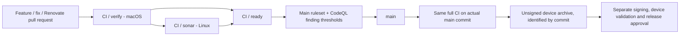

# CI and release policy

## Architecture

One workflow, one macOS build runner and two small Linux jobs. Pull requests and pushes to `main` run the same checks. `prototype/ios-mvp` is also enabled while introducing the pipeline; remove that branch from the triggers after migration.



`verify` runs a deliberately small SwiftFormat rule set, correctness-focused SwiftLint, property-list validation, host Swift Testing tests with coverage, a complete Simulator Debug build and an unsigned **device Release archive**. CodeQL traces that fresh Release build and uploads its Swift security analysis. Compiler warnings fail the build. The app's signing settings and bundle identifier are not changed; only CI disables signing.

There is no separate `xcodebuild analyze` job: the Clang Static Analyzer does not analyze Swift. CodeQL and Sonar provide the security/static analysis here. There is no Fastlane, self-hosted Sonar server, test matrix or dependency cache to maintain initially.

`sonar` downloads the reports from the same workflow and analyzes the same revision. It does not run project build scripts or tests. The Sonar token exists only in the scanner step, never in the macOS build environment. All third-party Actions are pinned to commit digests.

`ready` runs even after a dependency fails or is skipped, and requires **both** jobs to succeed. Configure this stable required status check instead of maintaining a long list of step names. A successful CodeQL action means analysis completed, not that it found no issues; the separate code-scanning ruleset condition is essential.

## What is tested now

The dependency-free Swift package compiles the app's existing `Sealbreak/Models.swift` directly. It does not maintain a second copy or change the Xcode target. Its 14 Swift Testing test functions cover C01 size limits and serialization overhead, URL normalization/rejection, share syntax and seal-status validation.

These are **host model tests**, not Simulator or iPhone integration tests. The separate Xcode builds compile all iOS files, but do not exercise Face ID, Keychain, privacy/lifecycle transitions, actual HTTP traffic or signed installation. The physical-device acceptance checks in issue #1 remain mandatory.

Coverage is generated once from these tests. `llvm-cov show` line counts are converted to Sonar's generic XML format. Only `Models.swift` receives measured coverage. Other app files stay in Sonar's source scope without coverage exclusions, and must not be presented as tested. New-code coverage gates may legitimately fail when untested iOS behavior is added; add the necessary tests rather than hiding those files. The per-line conversion was cross-checked against LLVM's LCOV export.

## One-time SonarQube Cloud setup

Import this public GitHub repository into your Sonar organization, then disable **Automatic Analysis** and use this CI-based workflow. For a pre-merge branch/PR quality gate, confirm that your organization has the **OSS plan** or another plan providing those features. Public visibility alone is not proof of the plan or its prerequisites. No license has been selected on your behalf.

Create the following GitHub repository settings, using the actual identifiers from Sonar rather than guessed values:

| Setting | Type | Value |
| --- | --- | --- |
| `SONAR_ORGANIZATION` | Actions variable | Sonar organization key |
| `SONAR_PROJECT_KEY` | Actions variable | Sonar project key |
| `SONAR_TOKEN` | Actions secret | A least-privileged token able to analyze this project |

The workflow targets the European/default service at `https://sonarcloud.io`. Organizations on a different Sonar region must change the configured service endpoint appropriately. Start with the current **Sonar way** quality gate and New Code definition; adjust requirements deliberately in Sonar, not with source exclusions. The scanner waits for the gate, so a failed quality gate fails `CI / sonar`.

Missing configuration fails visibly. There is no `continue-on-error`, placeholder token or successful skip. Establish a main-branch Sonar analysis before relying on PR comparisons. For a repository whose initial application exists only on the prototype branch, bootstrap the project/initial main analysis first and enable mandatory gates only once baseline results exist. Do not invent a green status to get through first-time setup.

## Public contributions and secrets

Fork PRs run the build/tests and CodeQL without custom repository secrets. Sonar then deliberately fails with an explanation because the token is unavailable. The supported initial process is: review the contribution, import the reviewed commit into a maintainer-owned branch, and open the mergeable PR from there. Changes to workflow/configuration files need particular scrutiny before that step.

Do **not** use `pull_request_target` to check out and execute contributor code with secrets. This pipeline also avoids a privileged `workflow_run` bridge that consumes untrusted build artifacts. Same-repository writers are a trusted boundary; review their workflow changes and restrict repository write access. PR workflows do not receive Apple credentials or production shares.

## Protecting main

`.github/main-ruleset.json` is an **import template**, not an already applied repository setting. It is deliberately disabled in the file to avoid locking an uninitialized repository. Import it under Settings > Rules > Rulesets after the first baseline runs, inspect it, and set enforcement to **Active**. If an equivalent ruleset already exists, update it rather than creating contradictory rules.

It requires pull requests, an up-to-date branch, resolved conversations, `CI / ready`, and CodeQL results with security severity **Medium or higher** or ordinary error findings blocked. Force-push and deletion are denied; the bypass list is empty. No second-person approval is forced for a solo-maintainer repository. Add required independent review when another reviewer is available. Select GitHub Actions as the expected source for the required check in the UI after its first run.

The workflow uses Advanced CodeQL setup; disable Default Setup if it was enabled, rather than running two competing configurations. Code-scanning protection needs baseline results on the target branch and the PR. Also enable GitHub secret scanning and push protection separately in repository settings. Do not assume arbitrary hexadecimal/Base64 OpenBao shares will be recognized by generic secret detection.

Only merge commits whose exact head passed all gates, with the branch current relative to main. No merge queue is configured; adding one later also requires `merge_group` workflow support and compatible Sonar analysis. Pushes to main are revalidated in full, so integration or external-scanner failures cannot be mistaken for a release approval.

## Renovate is the update bot

Install/authorize the hosted Renovate GitHub App for this repository. Configuration alone does not install it. Normally Renovate reads configuration from the repository's default branch; the committed MVP configuration becomes active after it reaches main and onboarding is complete. To trial it earlier, deliberately configure Renovate's base branch rather than assuming this branch is automatically scanned.

| Update surface | Source of truth | Renovate support |
| --- | --- | --- |
| Actions and literal runner labels | `.github/workflows/ci.yml` | Native `github-actions`, including SHA pins |
| SwiftLint and SwiftFormat | `Mintfile` | Native `mint` manager |
| Future application Swift packages | `Package.swift` / lockfiles | Native Swift manager; no extra bot |
| Mint itself | `scripts/ci/versions.env` | One annotated regex manager, GitHub releases |
| Xcode | `scripts/ci/versions.env` | Same regex manager, stable releases from the Xcode Releases feed |

Xcode is selected only from versions already installed on the runner. Renovate can propose a newer Xcode before GitHub installs it; that PR must wait or update the runner too. Xcode changes require dashboard approval. A published release is not proof of runner availability. Runner OS labels are fixed, but hosted images still receive updates; this is not a bit-for-bit reproducible VM image.

Updates are grouped conservatively, checked Monday mornings in Europe/Berlin, and limited to three concurrent PRs. Major updates need dashboard approval; automerge is off initially. All updates use the same CI. Keep Dependabot advisory alerts if useful, but do not enable its duplicate version-update PRs. No bot receives a main-branch bypass.

## Local commands

Use the Xcode and Mint versions in `scripts/ci/versions.env`, then run from the repository root:

```sh
mint run --silent nicklockwood/SwiftFormat swiftformat --lint Sealbreak Tests Package.swift
mint run --silent realm/SwiftLint swiftlint lint --strict
swift test --enable-code-coverage -Xswiftc -warnings-as-errors
bash scripts/ci/build.sh simulator
bash scripts/ci/build.sh archive
```

`setup.sh` is a GitHub-runner bootstrap; local development should select the same installed Xcode with `DEVELOPER_DIR`. `check.sh` additionally generates reports on macOS. Tool compilation is intentionally not cached yet: add a cache keyed by Xcode and Mintfile only if measured build times justify it.

## Release boundary

On main pushes, the build job retains `unsigned-ios-<commit>` for 14 days. The artifact is only eligible as a release candidate if **the entire corresponding workflow and all required security gates** succeeded. Artifact existence alone is not approval: the archive is created before Sonar finishes. It is not a signed IPA and is not installable or App-Store-validated merely because it archived successfully.

Signing, TestFlight upload and store publication are not wired to placeholder credentials. When distribution details are fixed, add a separate workflow with a protected release environment and Apple secrets available only after approval, checking the successful main commit before rebuilding/signing it. Never reuse the PR runner or export signing material there. For now, sign/archive that reviewed main commit in Xcode, validate it on hardware and record the result before releasing.

“Main is releasable” is therefore the policy enforced by build/quality/security gates plus release acceptance, not a promise that CI can certify Face ID, recovery, valid Apple provisioning or store review. This commit does not change the production app or settle the remaining risks in issue #1.

## References

[Clang analyzer language scope](https://clang.llvm.org/docs/ClangStaticAnalyzer.html), [CodeQL Swift builds](https://docs.github.com/en/code-security/code-scanning/creating-an-advanced-setup-for-code-scanning/codeql-code-scanning-for-compiled-languages), [code-scanning merge protection](https://docs.github.com/en/code-security/how-tos/find-and-fix-code-vulnerabilities/manage-your-configuration/set-merge-protection), [Sonar plans](https://docs.sonarsource.com/sonarqube-cloud/administering-sonarcloud/managing-subscription/subscription-plans), [Renovate Mint](https://docs.renovatebot.com/modules/manager/mint/), [Renovate Actions](https://docs.renovatebot.com/modules/manager/github-actions/), [Renovate custom datasources](https://docs.renovatebot.com/modules/datasource/custom/), [hosted runner inventory](https://github.com/actions/runner-images).
