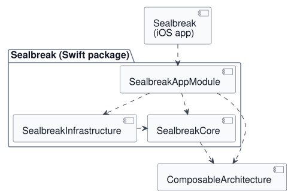

# Architecture

Sealbreak consists of an iOS app and one local Swift package.
Arrows show which module depends on another. The three package
modules live under `Sources/<ModuleName>`.

| Area | Responsibility | Example changes |
|---|---|---|
| **SealbreakCore** | Business rules, data models, and state transitions. Defines which steps are allowed and their required order. | Unseal prerequisites, server-data validation, recovery after interrupted setup. |
| **SealbreakInfrastructure** | Concrete access to networks and stored data. Uses the models and contracts defined in Core. | HTTP timeouts, Keychain storage, the `profiles.json` format, DNSSEC resolution. |
| **SealbreakAppModule** | Views, presentation, and animation. Connects Core to infrastructure adapters and iOS capabilities. | Button layout, status animations, Face ID integration, handling iOS system events. |
| **Sealbreak (iOS app)** | Starts the app and owns its resources and app configuration. | Assets, `InfoPlist.xcstrings`, `Info.plist`, entitlements. |

For a new feature, Core defines the behavior, Infrastructure provides
the required external access, and AppModule makes it usable.
A change may therefore span several modules; each responsibility
belongs in its respective module.
